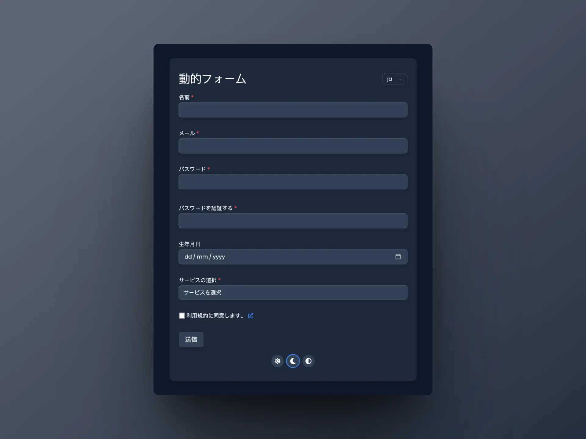
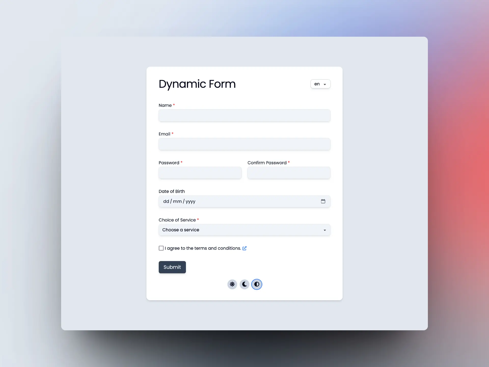
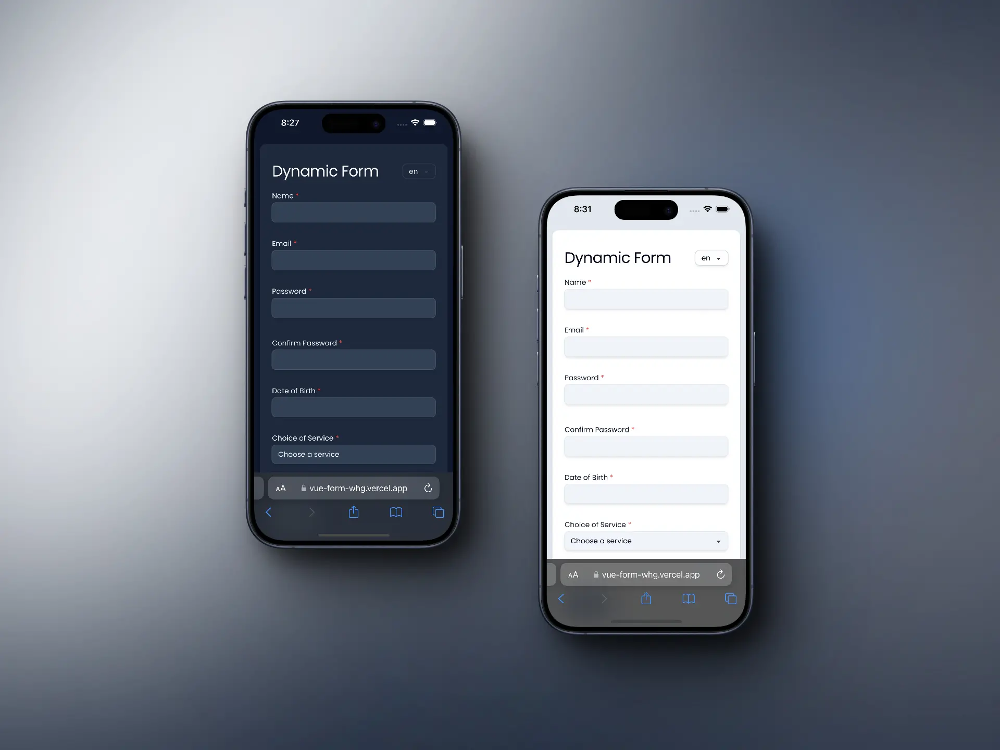

# WHG Vue Technical Test



## Project Overview

This project is a dynamic form built with Vue.js that includes validation, progressive disclosure, and internationalization (i18n). The form is designed to capture user information with various input types and enforced validation rules. Additionally, it supports responsive design, dark mode, and includes comprehensive testing.

## Live Demo

[Check out the live demo here](https://vue-form-whg.vercel.app)

## Setup Instructions

### Prerequisites

- Node.js (version 18.3 or later)
- npm (version 8.0.0 or later)

### Installation

1. Clone the repository:
   ```bash
   git clone https://github.com/greengem/vue-form-whg
   cd vue-form-whg
   ```
2. Install dependencies:
   ```bash
   npm install
   ```
3. (Optional) Install Playwright to run e2e tests:
   ```bash
   npx playwright install
   ```

### Running the Project

1. Start the development server:
   ```bash
   npm run dev
   ```
2. Open your browser and navigate to `http://localhost:5173/` to see the form in action.

### Running Tests

1. Run unit tests with Vitest:
   ```bash
   npm run test:unit
   ```
2. Run end-to-end tests with Playwright:
   ```bash
   npm run test:e2e
   ```
   Note: Playwright needs to be installed, see the installation section.

## Usage

### Form Inputs and Validation

- **Name**: Required, minimum 2 characters.
- **Email**: Required, must be a valid email format.
- **Password**: Required, minimum 8 characters with at least one number.
- **Confirm Password**: Required, must match the password.
- **Date of Birth**: Optional, must be a past date.
- **Choice of Service**: Dropdown with options (Web Development, Mobile Development, SEO Services, Other).
  - If "Other" is selected, an additional text input for specifying the service appears.
- **Terms and Conditions**: Checkbox, must be checked before submission.

### Form Submission

- Upon successful validation, a success message is displayed.
- If validation fails, errors are highlighted and displayed next to the respective input fields.

## Implementation Details

### Key Vue.js Features Used

- **Reactive Forms**: Utilized Vue's reactivity to manage form state and validation.
- **Computed Properties**: Used for derived state, such as dynamic validation messages and progressive disclosure logic.
- **Vue Router**: For navigation, including a link to the Terms and Conditions page.
- **Tailwind CSS**: For styling and responsive design.
- **Vue-i18n**: For internationalization, supporting English, Spanish, and Japanese.
- **LocalStorage**: For persisting language and dark mode preferences.

### Progressive Disclosure

- The "Other" option in the service dropdown reveals an additional input field for specifying the service.

### Validation Enhancements

- Validation occurs on submit and when input fields lose focus.
- Real-time validation updates as the user corrects errors.
- Visual indicators show validation status (green for valid, red for invalid).

### Dark Mode

- The theme color is initially decided by the user's system preference
- A dark mode toggle is available, with the preference stored in local storage.

### Internationalization (i18n)

- Implemented using `vue-i18n` with support for English, Spanish, and Japanese.
- The initial language setting is based on the user's browser preferences, falling back to English if no preference is stored in local storage.
- A language switcher component allows dynamic language changes, which are persisted in local storage for subsequent visits.

## About the `useForm` Composable

The `useForm` composable is central to the form handling logic in this project, demonstrating an advanced understanding of Vue's composition API and reactive programming principles. Here's a breakdown of its key features and benefits:

### Design Principles

- **Reactivity and Composition API**: Utilizes Vue's reactive system and composition functions to encapsulate and manage form state and validation logic efficiently.
- **Custom Validation Framework**: Implements a flexible validation system that can easily be extended or modified to fit different form requirements or validation rules.

### Features

- **Dynamic Error Handling**: The composable dynamically assigns and clears error messages based on custom validation rules defined for each form field. This ensures that users receive immediate feedback on their input, improving the user experience.
- **Internationalization Support**: Error messages are internationalized using `vue-i18n`, allowing for easy localization of the form into multiple languages.
- **Form State Management**: Manages the state of multiple form fields with a clear structure, making it easy to track changes and the current status of the form.
- **Scalability**: Designed to be easily extendable for additional form fields or different types of inputs without significant modifications to the existing structure.

### Code Snippet

Here is a brief look at how the `useForm` composable is structured:

```typescript
export function useForm() {
  const form = reactive<FormState>({ ... });
  const errors = reactive<ErrorState>({ ... });
  const isSuccess = ref(false);

  // Validation logic and form handling functions
}
```

### Validation Strategy

- **Field-Level Validation**: Each input field is validated independently, allowing specific feedback per field and minimizing the user's error correction efforts.
- **Form-Wide Validation**: Before submission, the entire form is validated to ensure all inputs meet the required standards, safeguarding against partial or malformed submissions.

### Usage

To use this composable, simply import it into a Vue component, and bind it to the template. It handles all aspects of form state, including input validation, error message display, and submission state management.

### Integration Example

```vue
<template>
  <form @submit.prevent="handleSubmit">
    <input v-model="form.name" @blur="validateField('name')" />
    <span>{{ errors.name }}</span>
    <!-- Repeat for other fields -->
  </form>
</template>

<script setup>
import { useForm } from '@/composables/useForm'

const { form, errors, validateField, handleSubmit } = useForm()
</script>
```

## Project Structure

### Important Files

- **/src/composables/useForm.ts**: Contains the composable function to handle form state and validation logic.
- **/src/locales/**:
  - **en.json**: English translations.
  - **es.json**: Spanish translations.
  - **ja.json**: Japanese translations.
- **/src/components/form/**:
  - **FormWrapper.vue**: Style wrapper component for the entire form.
  - **FormComponent.vue**: Main form component, contains the fields.
  - **FormHeader.vue**: Header of the form, containing the title and language switcher.
  - **FormSuccess.vue**: Success message box shown on successful completion of the form.
- **/src/components/form/fields/**:
  - **FormFieldWrapper.vue**: Style wrapper component for each field.
  - **FormLabel.vue**: Label for each form field.
  - **FormError.vue**: Component that displays error messages in fields.
  - **FormButton.vue**: Reusable form button.
  - **FormCheckbox.vue**: Reusable checkbox component.
  - **FormInput.vue**: Reusable input component.
  - **FormSelect.vue**: Reusable select component.
- **/src/components/common/**:
  - **LanguageSwitcher.vue**: Component for changing languages.
  - **DarkModeToggle.vue**: Component for toggling dark mode.
- **/src/tests/components/form/FormComponent.spec.ts**: Full suite of unit tests for the form.
- **/src/tests/i18n.ts**: i18n setup for unit tests.
- **/e2e/vue.spec.ts**: Playwright end-to-end test.

## Assumptions

- Users will have JavaScript enabled in their browsers.
- The form does not need to handle server-side validation or submission.
- The initial language for internationalization is set based on the user's browser settings.

## Future Enhancements

If given more time, I would like to implement the following features:

- **Debouncing Input Updates**: Implement debouncing for input updates when correcting a validation error to enhance performance.
- **Custom Select Element**: Develop a custom select element for improved functionality and styling.
- **Custom Date Picker Element**: Create a custom date picker element to offer a better user experience.
- **Custom Checkbox Element**: Build a custom checkbox element for more control over design and behavior.

## Conclusion

This project demonstrates the use of Vue.js for building a dynamic, validated, and internationalized form. It showcases key Vue.js features and adheres to modern web development practices, making it a robust solution for capturing user information.



